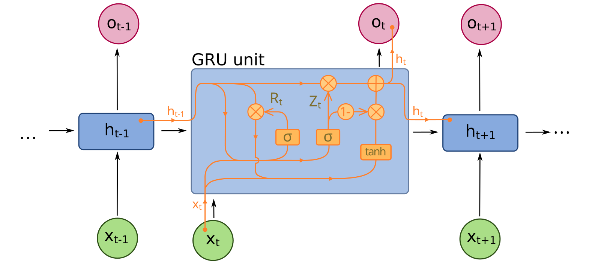
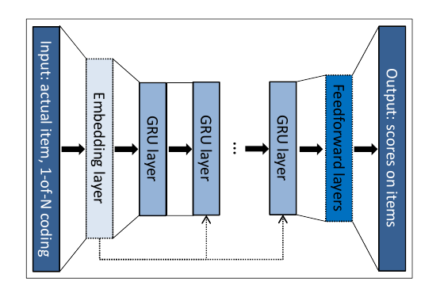
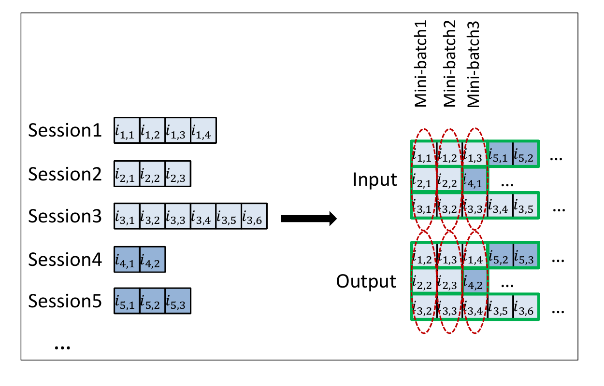
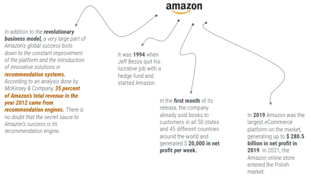
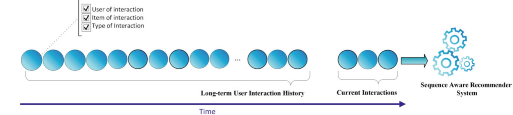
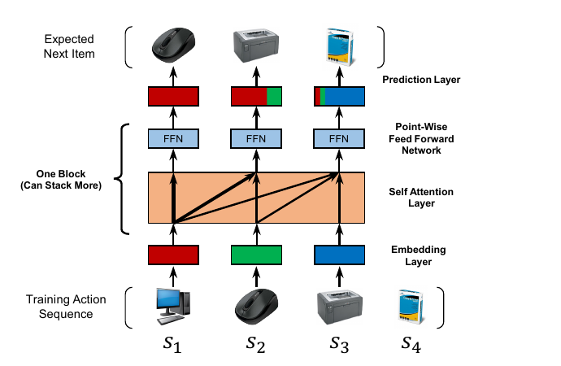
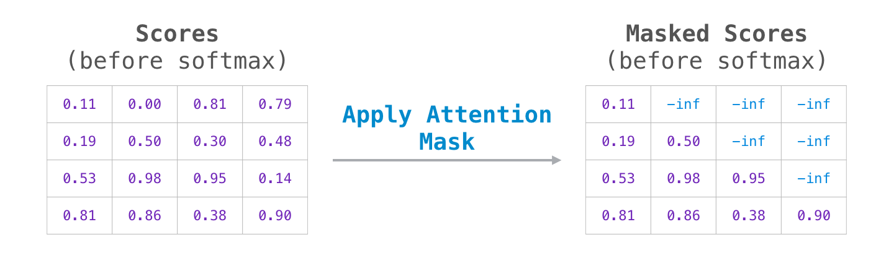

# 01 Announcements and Context {background-color="#EF7C00"}

::: notes
Delivery: 30 seconds. Welcome students, flag the quiz co-creation notice, and state that the opening moves quickly into the Week 04-to-Week 05 bridge.
:::

```{=html}
<div aria-labelledby="w05-changelog-title" style="margin:1.2em auto 0;max-width:72%;padding:.55em .8em;border-left:3px solid #003D7C;border-radius:0 6px 6px 0;background:rgba(255,255,255,.78);color:#003D7C;font-family:Arial,Helvetica,sans-serif;font-size:.42em;line-height:1.35;">
  <h5 id="w05-changelog-title" style="margin:0 0 .25em;font-size:1em;font-weight:700;letter-spacing:.04em;text-transform:uppercase;">Changelog</h5>
  <ul style="margin:0;padding-left:1.2em;">
    <li><strong class="cp-text--navy">6 Sep 2026</strong> — Added the Weeks 01–05 quiz-question contribution and Week 07 quiz details.</li>
    <li><strong class="cp-text--navy">5 Sep 2026</strong> — Added the Week 04 recap and Week 06 preview.</li>
  </ul>
</div>
```

## {background-color="#1a0a2e"}

```{=html}
<div class="cp-frame-bg cp-frame-purple"></div>
<div class="cp-frame-content cp-thumbnail-recap-content" style="color:white;">
  <div class="cp-frame-label" style="background:#5C2D91;color:white;margin-bottom:0;">WEEK 04 RECAP</div>
  <div class="cp-thumbnail-composite-wrap">
    
  </div>
</div>
```

::: notes
Delivery: 3-minute recap. Read the quadrants clockwise: (1) attention turns queries, keys, and values into contextual representations; (2) NeuMF combines a coordinate-wise GMF path with a nonlinear MLP path; (3) the training objective matters - pointwise learning predicts an interaction label, while BPR learns an ordering between an observed and sampled item; and (4) neither architecture is inherently robust to coordinated manipulation in the log. Ask: “What does this leave out?” Answer: all four Week 04 models score a user-item relationship without representing the order of a user’s recent actions. Week 05 adds that sequence and session context.

[Sources]

- Week 04, slides 9, 14, 19, and 35.
:::

## Quizzes - From Week 01 (10%)

- Quizzes are **jointly created by peers and instructors**
- Peers contribute candidate questions, answers, and worked solutions where needed
  - Min assigns each student a week, lecture section, difficulty, and question format.
  - Min curates, verifies, and finalises questions so that assessments remain fair, accurate, and aligned with the course learning outcomes.
- Combined worth **10%** of total marks
- **AI tools must not be used during in-class quizzes.**

::: {.callout-note}
Co-creation makes quizzes part of the pilot course: students help build better learning materials for this cohort and future cohorts.
:::

::: notes
Delivery: 1 minute. Keep this administrative notice to its essential policy: peers propose questions, instructors curate them, and in-class quizzes are AI-free.
:::

## Peer Quiz Question-Bank Contribution {background-color="#ffffff"}

```{=html}
<div style="font-size:.82em;line-height:1.22;">
  <p style="margin:.05em 0 .42em;">Covers <strong>Weeks 01–05</strong>. Your identifier determines one lecture section and one difficulty: <strong>easy, medium, or hard</strong>.</p>
  <p style="margin:.1em 0 .22em;color:#003D7C;font-weight:bold;">Your assigned contribution</p>
  <ul style="margin:.08em 0 .4em;padding-left:1.15em;">
    <li><strong>Two MCQ/MRQ questions</strong>, <strong>two fill-in-the-blank questions</strong>, or <strong>one calculation question</strong> with full working</li>
    <li>Include the answer for every question.</li>
  </ul>
  <p style="margin:.2em 0 .18em;">Submit on Canvas by <strong><span class="cp-text--teal">Mon, 21 Sep 2026, 23:59 SGT</span></strong>. You have two weeks to prepare.</p>
  <p style="margin:0 0 .58em;color:#003D7C;"><strong><span class="cp-text--teal">5 points</span> (1% of total marks) for completion only.</strong></p>
  <div class="cp-card cp-card--soft" style="padding:.55em .72em;">
    <p class="cp-card__title" style="margin-bottom:.18em;">Week 07 (Open Book) Quiz <span class="cp-text--teal">· Tue, 29 Sep 2026</span></p>
    <p style="margin:0;"><strong><span class="cp-text--teal">~30 minutes</span></strong> at the beginning of class. A mix of instructor and peer questions, completed on paper and proctored.</p>
  </div>
</div>
```

# 02 Lecture Overview {background-color="#EF7C00"}

## {background-color="#ffffff"}

```{=html}
<div class="cp-frame-bg cp-frame-navy"></div>
<div class="cp-frame-content">
  <div class="cp-frame-label" style="background:#003D7C;color:#EF7C00;">Last Week Pre-Lecture Exercise</div>
  <div class="cp-frame-title cp-text--navy">Where Does One Session End?</div>
  <div class="cp-frame-body" style="color:#333;font-size:.72em;line-height:1.2;">
    <div class="cp-grid cp-grid--2" style="align-items:start;grid-template-columns:minmax(220px,.68fr) minmax(0,1.32fr);gap:1.05em;">
      <figure style="margin:0;text-align:center;">
        <a href="https://www.straitstimes.com/singapore/google-rolls-out-updated-ai-powered-ask-maps-feature-in-singapore" target="_blank" rel="noopener" aria-label="Open the Straits Times optional reading about Google Ask Maps">
          
        </a>
        <figcaption style="margin-top:.28em;color:#5F6B7A;font-size:.56em;line-height:1.15;"><a href="https://www.straitstimes.com/singapore/google-rolls-out-updated-ai-powered-ask-maps-feature-in-singapore" target="_blank" rel="noopener" style="color:#003D7C;">Optional reading: <em>The Straits Times</em>, 11 Aug 2026</a></figcaption>
      </figure>
      <div>
        <p style="font-weight:bold;color:#003D7C;margin:0 0 .36em;">Canvas discussion board · post before <span class="cp-text--teal">Mon, 7 Sep 2026 · 23:59 SGT</span></p>
        <p style="margin:.10em 0 .42em;">Post one <strong>100–140 word</strong> decision memo. No classmate reply is required.</p>
        <div style="margin:.14em 0 .46em;padding:.62em .76em;border-left:7px solid #00796B;background:#F0F8F6;font-size:1em;line-height:1.22;color:#003D7C;font-weight:bold;">
          A person asks Ask Maps for a 2pm lunch route, explores nearby cultural sites, then later asks for a halal eatery open after 10pm. Does the late-evening query begin a new session? Answer yes or no and cite two trace details.
        </div>
        <p style="margin:.38em 0 0;color:#003D7C;font-weight:bold;font-size:.92em;">Next week: sequences make order, recency, and local context part of the recommendation signal.</p>
      </div>
    </div>
  </div>
</div>
```

::: notes
Delivery: introduce this as a pre-lecture activation task, not a test of GRU4Rec, SASRec, or Transformer knowledge. The optional article offers a familiar Singapore example of context-aware planning; it is a product illustration, not evidence that Ask Maps uses a particular sequence architecture. Expected output: one 100–140 word decision memo that answers yes or no and defends the proposed session boundary with two trace details. There is no classmate reply this week.

Instructor synthesis for Week 05: cluster the yes/no judgments around time gap, task shift, and contextual continuity. Establish that sessionisation is a modelling decision informed by observed traces, rather than direct proof of a person’s intent.

[Sources]
- Ng, A. (2026, 11 August). “Google rolls out new AI-powered Ask Maps feature in Singapore.” <em>The Straits Times</em>. Optional reading. https://www.straitstimes.com/singapore/google-rolls-out-updated-ai-powered-ask-maps-feature-in-singapore
:::

## {background-color="#ffffff"}

```{=html}
<div class="cp-frame-bg cp-frame-navy"></div>
<div class="cp-frame-content w05-canvas-voices" style="padding-top:22px;">
  <div class="cp-frame-label" style="background:#003D7C;color:#EF7C00;">Last Week Pre-Lecture Exercise · Canvas Voices</div>
  <div class="cp-frame-body" style="color:#333;min-height:0;">
    <div aria-label="Eight anonymised Canvas quotations, split between students who would retain the session and students who would begin a new one" style="display:grid;grid-template-columns:minmax(0,1fr) minmax(0,1fr);gap:1.35em;min-height:0;">
      <div role="group" aria-label="No, retain the session" style="min-width:0;padding:.36em .55em .32em .82em;border-top:5px solid #5C2D91;background:#F7F3FB;">
        <h3 style="margin:0 0 .35em;color:#5C2D91;font-size:.52em;line-height:1.05;">NO · Retain the session</h3>
        <div style="display:grid;grid-template-rows:repeat(4,auto);gap:.43em;">
          <article style="position:relative;margin-left:.44em;padding:.30em .43em .30em .72em;border:2px solid #D6C8E8;border-radius:12px 12px 12px 3px;background:#fff;color:#273244;"><p style="margin:0;font-size:.36em;font-style:italic;line-height:1.13;">“I assume all three queries … are issued sequentially in one sitting, with no idle gap.”</p></article>
          <article style="position:relative;margin-left:.44em;padding:.30em .43em .30em .72em;border:2px solid #D6C8E8;border-radius:12px 12px 12px 3px;background:#fff;color:#273244;"><p style="margin:0;font-size:.36em;font-style:italic;line-height:1.13;">“The word ‘then’ implies that the query is on the same itinerary.”</p></article>
          <article style="position:relative;margin-left:.44em;padding:.30em .43em .30em .72em;border:2px solid #D6C8E8;border-radius:12px 12px 12px 3px;background:#fff;color:#273244;"><p style="margin:0;font-size:.36em;font-style:italic;line-height:1.13;">“I would keep the same session while placing more emphasis on the most recent request.”</p></article>
          <article style="position:relative;margin-left:.44em;padding:.30em .43em .30em .72em;border:2px solid #D6C8E8;border-radius:12px 12px 12px 3px;background:#fff;color:#273244;"><p style="margin:0;font-size:.36em;font-style:italic;line-height:1.13;">“A good recommender should avoid recommending it twice for lunch and again for supper.”</p></article>
        </div>
      </div>
      <div role="group" aria-label="Yes, begin a new session" style="min-width:0;padding:.36em .55em .32em .82em;border-top:5px solid #00796B;background:#F0F8F6;">
        <h3 style="margin:0 0 .35em;color:#00796B;font-size:.52em;line-height:1.05;">YES · Begin a new session</h3>
        <div style="display:grid;grid-template-rows:repeat(4,auto);gap:.43em;">
          <article style="position:relative;margin-left:.44em;padding:.30em .43em .30em .72em;border:2px solid #B9DDD4;border-radius:12px 12px 12px 3px;background:#fff;color:#273244;"><p style="margin:0;font-size:.36em;font-style:italic;line-height:1.13;">“Session data should only contain information … useful to the current context, whilst more general preferences … can be persisted across sessions.”</p></article>
          <article style="position:relative;margin-left:.44em;padding:.30em .43em .30em .72em;border:2px solid #B9DDD4;border-radius:12px 12px 12px 3px;background:#fff;color:#273244;"><p style="margin:0;font-size:.36em;font-style:italic;line-height:1.13;">“Adding previous search context into an explicit ask is un-expected and might not be good UX.”</p></article>
          <article style="position:relative;margin-left:.44em;padding:.30em .43em .30em .72em;border:2px solid #B9DDD4;border-radius:12px 12px 12px 3px;background:#fff;color:#273244;"><p style="margin:0;font-size:.36em;font-style:italic;line-height:1.13;">“Starting a new session does not mean discarding all earlier information.”</p></article>
          <article style="position:relative;margin-left:.44em;padding:.30em .43em .30em .72em;border:2px solid #B9DDD4;border-radius:12px 12px 12px 3px;background:#fff;color:#273244;"><p style="margin:0;font-size:.36em;font-style:italic;line-height:1.13;">“That is roughly eight hours of inactivity, well beyond a typical session timeout window of thirty to sixty minutes.”</p></article>
        </div>
      </div>
    </div>
  </div>
</div>
```

::: notes
Delivery: 4 minutes. Read each column as an alternating conversation. The disagreement centres on the assumptions used to convert a trace into a boundary: continuity and retained context on the left; time gap, task shift, and user expectations on the right.

[Sources]
- Canvas discussion: Phua Qing Rong, Toh Yi Fan, V Varsha, and Zhang Ming Jun (retain the session); Shi Ziyuan, Lin Hong Yi, Tong Jing Yen, and Choi Minseok (begin a new session), Week 05 pre-lecture exercise, accessed 8 Sep 2026. Quotations are excerpted verbatim and portraits are shown without names.
:::

## Which interaction history is available?

```{=html}
<div class="cp-grid cp-grid--2" style="grid-template-columns:minmax(0,1.75fr) minmax(235px,.65fr);align-items:center;gap:.75em;">
  <figure style="margin:0;">
    <a href="https://doi.org/10.1007/978-3-031-42559-2" target="_blank" rel="noopener" aria-label="Open the source for the interaction-history figure">
      
    </a>
  </figure>
  <div class="cp-stack" style="font-size:.72em;line-height:1.14;">
    <div class="cp-card cp-card--soft" style="padding:.42em .55em;"><p class="cp-card__title">Session-based</p><p style="margin:0;">Use the ordered events in the current session when no history is available.</p></div>
    <div class="cp-card cp-card--soft" style="padding:.42em .55em;"><p class="cp-card__title">Session-aware</p><p style="margin:0;">Combine the current session with earlier sessions from an identified user.</p></div>
    <div class="cp-card cp-card--soft" style="padding:.42em .55em;"><p class="cp-card__title">Sequence-aware</p><p style="margin:0;">Model a longer ordered history when earlier interactions may still matter.</p></div>
  </div>
</div>
<p style="margin:.35em 0 0;padding-top:.25em;border-top:1px solid #c8d5df;color:#5F6B7A;font-size:.34em;line-height:1.15;">Source: Ravanmehr, R., &amp; Mohamadrezaei, R. (2024). <em>Session-based recommender systems using deep learning</em> (Fig. 1.3, p. 15). Springer. <a href="https://doi.org/10.1007/978-3-031-42559-2" target="_blank" rel="noopener" style="color:#003D7C;text-decoration:underline;">https://doi.org/10.1007/978-3-031-42559-2</a></p>
```

::: notes
Delivery: 3 minutes. Use the figure to separate three questions that the literature sometimes names inconsistently. Session-based recommendation sees only the current ordered session. Session-aware recommendation joins that local evidence to earlier sessions. Sequence-aware recommendation draws on a longer ordered interaction history. The three settings can all predict a next item, but they justify different claims about what evidence the model may use.

[Source]
- Ravanmehr and Mohamadrezaei (2024), <em>Session-Based Recommender Systems Using Deep Learning</em>, Fig. 1.3, p. 15. The original rotated figure has been extracted and rotated for legibility.
:::

## Week 05: What changes when interactions have an order?

<div class="cp-grid cp-grid--2">
  <div class="cp-card cp-card--soft"><p class="cp-card__title">Week 04</p><p style="margin:0;">Attention selected useful features for a user–item score.</p></div>
  <div class="cp-card cp-card--soft"><p class="cp-card__title">Week 05</p><p style="margin:0;">A sequence model selects useful <strong>earlier actions</strong> to predict the next item.</p></div>
</div>

<p style="margin-top:.8em;">By the end of today, you should be able to:</p>

- model temporal preferences;
- implement next-item prediction;
- compare static and dynamic representations; and
- critically assess engagement-driven objectives.

::: notes
Delivery: 3 minutes. This is a bridge, not a second Transformer lecture. The recurring question is whether a system should use history, current-session evidence, or both.
:::

# 03 Session-Based Models {background-color="#EF7C00"}

::: notes
Delivery: 30 seconds. Frame this half as a response to immediate, often anonymous intent; its question is what to use right now without making a lasting claim about the person.
:::

## The immediate-intent problem

<div class="cp-grid cp-grid--2">
  <div class="cp-card cp-card--soft"><p class="cp-card__title">Observed now</p><p style="margin:0;">“late-night halal food” → nearby restaurant pages → delivery times</p></div>
  <div class="cp-card cp-card--warning"><p class="cp-card__title">Do not infer too much</p><p style="margin:0;">A short trace can reveal a task without revealing a permanent identity or preference.</p></div>
</div>

<p style="margin-top:.8em;"><strong>Session-based recommendation:</strong> predict a next item from the ordered interactions in the current, often anonymous, session.</p>

::: {.callout-note}
**“Often anonymous” includes logged-in use:** a system can keep the current session separate from the long-term profile, letting a temporary task guide the next recommendation without becoming permanent.
:::

::: notes
Delivery: 2.5 minutes. Tie this directly to the Ask Maps exercise. A session can be short, incomplete, and ambiguous; it is still often the strongest available signal for the immediate task.
:::

## 🎰 Bandit Time: What should this system use? {background-color="#003D7C"}

```{=html}
<div class="cp-activity cp-activity--navy cp-activity--framed cp-grid cp-grid--2-aside"><div><p class="cp-activity__prompt">An anonymous visitor opens three restaurant pages <strong>in sequence</strong> during a late-night visit. Before recommending the next page, which should be the system’s primary representation of the visitor’s immediate intent?</p><div class="cp-choice-grid"><div class="cp-choice-card cp-choice-card--a"><strong class="cp-choice-card__letter">A.</strong><span class="cp-choice-card__text">A permanent “late-night diner” profile inferred from IP location and device locale</span></div><div class="cp-choice-card cp-choice-card--b"><strong class="cp-choice-card__letter">B.</strong><span class="cp-choice-card__text">The ordered prefix of pages in the current session</span></div><div class="cp-choice-card cp-choice-card--c"><strong class="cp-choice-card__letter">C.</strong><span class="cp-choice-card__text">An unordered bag of the three pages, ranked by citywide click-through rate</span></div><div class="cp-choice-card cp-choice-card--d"><strong class="cp-choice-card__letter">D.</strong><span class="cp-choice-card__text">The highest-rated restaurant page the visitor has not opened</span></div></div></div><div class="cp-activity__timer cp-center"><div class="cp-timer"><svg width="140" height="140" viewBox="0 0 180 180" aria-label="Thirty-second countdown timer"><circle cx="90" cy="90" r="75" fill="none" stroke="#ddd" stroke-width="14"></circle><circle id="w05-session-mcq-ring" class="cp-timer__ring" cx="90" cy="90" r="75" fill="none" stroke="#EF7C00" stroke-width="14" stroke-dasharray="471.24" stroke-dashoffset="0" stroke-linecap="round" transform="rotate(-90 90 90)"></circle><text id="w05-session-mcq-text" class="cp-timer__text" x="90" y="98" text-anchor="middle" font-family="Arial" font-size="26" font-weight="bold" fill="#00796B">00:30</text></svg><span id="w05-session-mcq-status" role="timer" aria-live="polite" class="cp-sr-only">00:30</span><button id="w05-session-mcq-btn" type="button" class="cp-timer__button" data-cp-timer data-seconds="30" data-ring="w05-session-mcq-ring" data-text="w05-session-mcq-text" data-status="w05-session-mcq-status">▶ Start Timer</button></div></div></div>
```

::: notes
Activity mode: MCQ/response. Timebox: 30 seconds, then a 1 minute 30 second debrief. Expected answer: B. The ordered current-session prefix represents immediate evidence without converting a brief task into a permanent profile. A makes a sensitive, weakly supported inference; C loses order and substitutes aggregate popularity; D ignores the observed trace.
:::

## Sessionisation is a modelling decision

```{=html}
<div class="cp-grid cp-grid--3">
  <div class="cp-flow-card"><strong>1. Temporal context</strong><ul style="margin:.38em 0 0;padding-left:1.05em;font-size:.83em;line-height:1.24;"><li>Timestamp and inactivity gap</li><li>Visit duration and event pace</li></ul></div>
  <div class="cp-flow-card"><strong>2. Content and task context</strong><ul style="margin:.38em 0 0;padding-left:1.05em;font-size:.83em;line-height:1.24;"><li>Query terms and item categories</li><li>Action types and stated constraints</li></ul></div>
  <div class="cp-flow-card"><strong>3. Interaction and situational context</strong><ul style="margin:.38em 0 0;padding-left:1.05em;font-size:.83em;line-height:1.24;"><li>Navigation path and device or browser</li><li>Location and account continuity</li></ul></div>
</div>
```

::: {.callout-note}
The boundary is an operational rule, not direct proof of intent.
:::

::: {.callout-tip .to-think-about title="To think about"}
A device, location, or account signal may improve next-item accuracy. What user expectation or privacy cost should limit its use?
:::

::: notes
Delivery: 3 minutes. Name the three evidence classes before discussing a boundary rule: temporal context, content and task context, and interaction and situational context. A thirty-minute timeout is a policy choice. Evaluate it against task coherence and product consequences; none of these signals proves intent.
:::

## 👥 Deciding what starts a new session? 📶 {background-color="#003D7C"}

```{=html}
<div class="cp-activity cp-activity--navy cp-activity--framed cp-grid cp-grid--2-aside"><div><p class="cp-activity__prompt">Your group owns one session-boundary method. Apply it to the Ask Maps trace, then compare it with the shared 30-minute inactivity baseline.</p><div class="cp-card cp-card--warning" style="margin-top:.45em;padding:.42em .55em;"><p class="cp-card__title">Shared simplified implementation</p><p style="margin:0;"><strong>Fixed inactivity:</strong> begin a new session after 30 minutes with no event. It is clear and cheap, but one threshold cannot fit every task.</p></div><div class="cp-grid cp-grid--2" style="margin-top:.5em;gap:.55em;"><div class="cp-card cp-card--soft"><p class="cp-card__title">1. Adaptive timeout</p><p style="margin:0;">Change the gap using event pace, device, time of day, or product context.</p></div><div class="cp-card cp-card--soft"><p class="cp-card__title">2. Task similarity</p><p style="margin:0;">Split when queries, items, or actions indicate a different task.</p></div><div class="cp-card cp-card--soft"><p class="cp-card__title">3. Boundary classifier</p><p style="margin:0;">Learn a same-task or new-task decision from labelled traces.</p></div><div class="cp-card cp-card--soft"><p class="cp-card__title">4. Intent change point</p><p style="margin:0;">Infer when the likely hidden intent state changes.</p></div></div></div><div class="cp-activity__timer cp-center"><div class="cp-timer"><svg width="140" height="140" viewBox="0 0 180 180" aria-label="Three-minute group discussion timer"><circle cx="90" cy="90" r="75" fill="none" stroke="#ddd" stroke-width="14"></circle><circle id="w05-boundary-clinic-ring" class="cp-timer__ring" cx="90" cy="90" r="75" fill="none" stroke="#EF7C00" stroke-width="14" stroke-dasharray="471.24" stroke-dashoffset="0" stroke-linecap="round" transform="rotate(-90 90 90)"></circle><text id="w05-boundary-clinic-text" class="cp-timer__text" x="90" y="98" text-anchor="middle" font-family="Arial" font-size="26" font-weight="bold" fill="#00796B">03:00</text></svg><span id="w05-boundary-clinic-status" role="timer" aria-live="polite" class="cp-sr-only">03:00</span><button id="w05-boundary-clinic-btn" type="button" class="cp-timer__button" data-cp-timer data-seconds="180" data-ring="w05-boundary-clinic-ring" data-text="w05-boundary-clinic-text" data-status="w05-boundary-clinic-status">▶ Start Timer</button></div></div></div>
```

::: notes
Activity mode: small-group discussion. Total timebox: 10 minutes. Use the displayed timer for 3 minutes of group writing, then allow 2 minutes for one concise report from each group, 2 minutes for AI Voice critique, 1 minute for student critique, and 2 minutes for instructor synthesis. Expected output: one boundary, the evidence it needs, and one failure case compared with a fixed 30-minute inactivity rule.

The numbered group options are: (1) adaptive timeout; (2) task similarity; (3) supervised boundary classifier; and (4) latent-intent change point. Fixed inactivity remains the shared baseline rather than a group assignment.

After reports, ask AI Voice: “For each proposed session-boundary rule, what useful behaviour could it incorrectly split or incorrectly merge?” Treat the reply as an object of critique, not an answer. Instructor synthesis: fixed inactivity is a reproducible baseline; adaptive rules reflect interaction pace; task similarity recognises a change of purpose; classifiers combine signals but inherit labels and policy choices; latent-state models represent uncertainty but are harder to validate and explain.
:::

## From an event log to next-item examples

```{=html}
<div class="cp-flow-card cp-flow-card--sequence"><span class="cp-flow-step">view ramen</span><span class="cp-flow-arrow" aria-hidden="true">→</span><span class="cp-flow-step">open halal filter</span><span class="cp-flow-arrow" aria-hidden="true">→</span><span class="cp-flow-step">inspect delivery time</span><span class="cp-flow-arrow" aria-hidden="true">→</span><strong class="cp-flow-step">predict: late-night restaurant</strong></div>
```

<table class="cp-table cp-table--compact" style="margin-top:.75em;"><thead><tr><th>Observed prefix</th><th>Training target</th></tr></thead><tbody><tr><td class="cp-table__cell">[ramen]</td><td class="cp-table__cell cp-table__cell--highlight">halal filter</td></tr><tr><td class="cp-table__cell">[ramen, halal filter]</td><td class="cp-table__cell cp-table__cell--highlight">delivery time</td></tr><tr><td class="cp-table__cell">[ramen, halal filter, delivery time]</td><td class="cp-table__cell cp-table__cell--highlight">late-night restaurant</td></tr></tbody></table>

::: notes
Delivery: 3 minutes. Read this as a minimal implementation contract: preserve order, form prefix-target pairs, train only on earlier events, and evaluate on later withheld events.
:::

## {background-color="#003D7C"}

<div style="height:72vh;display:flex;flex-direction:column;align-items:center;justify-content:center;text-align:center;color:#fff;">
  <p style="max-width:1100px;margin:0;font-size:2.05em;line-height:1.18;font-weight:bold;color:#fff;">GRU4Rec</p>
  <p style="max-width:920px;margin:.85em 0 0;padding-top:.5em;border-top:1px solid rgba(255,255,255,.48);color:rgba(255,255,255,.88);font-size:.42em;line-height:1.25;">Paper: <a href="https://arxiv.org/abs/1511.06939" target="_blank" rel="noopener" style="color:#EF7C00;text-decoration:underline;">Hidasi, B., Karatzoglou, A., Baltrunas, L., &amp; Tikk, D. (2016). <em>Session-based Recommendations with Recurrent Neural Networks</em>. ICLR.</a></p>
</div>


::: notes
Delivery: 30 seconds. Use this as a pivot from ordered prefix-target examples to a learned session representation. GRU4Rec does not declare who the visitor is; it updates a representation of what the current session may require.

[Source]
- Hidasi, B., Karatzoglou, A., Baltrunas, L., &amp; Tikk, D. (2016). “Session-based Recommendations with Recurrent Neural Networks.” <em>International Conference on Learning Representations</em>. https://arxiv.org/abs/1511.06939
:::

## <span style="color:#ffffff;">🎥 Video: GRU intuition</span> {background-color="#000000"}

```{=html}
<div style="display:flex;align-items:center;justify-content:center;width:100%;height:76vh;background:#000;">
  <a href="https://www.youtube.com/watch?v=IBs8D8PWMc8&amp;t=282s" target="_blank" rel="noopener" aria-label="Open video: Gated Recurrent Unit explanation">
    
  </a>
</div>
```

::: notes
Delivery: 2 minutes. Play 4:42–6:42 only. Stop on time. Ask for one gate-based explanation; do not treat this external video as an authority on recommender systems.

[Source]
- Learn With Jay, “Gated Recurrent Unit | GRU | Explained in detail,” YouTube, 2024. https://www.youtube.com/watch?v=IBs8D8PWMc8
:::

## GRU4Rec: carry a changing session state

```{=html}
<div class="cp-grid cp-grid--2" style="grid-template-columns:minmax(0,1.55fr) minmax(250px,.7fr);align-items:center;gap:1em;">
  <figure style="margin:0;min-width:0;">
    <a href="https://commons.wikimedia.org/wiki/File:Gated_Recurrent_Unit.svg" target="_blank" rel="noopener" aria-label="Open the source for the GRU diagram">
      
    </a>
    <figcaption style="margin-top:.32em;padding-top:.24em;border-top:1px solid #c8d5df;color:#5F6B7A;font-size:.34em;line-height:1.15;">Click diagram for source · fdeloche, <em>Gated Recurrent Unit</em>, <a href="https://creativecommons.org/licenses/by-sa/4.0/" target="_blank" rel="noopener" style="color:#003D7C;text-decoration:underline;">CC BY-SA 4.0</a>, via <a href="https://commons.wikimedia.org/wiki/File:Gated_Recurrent_Unit.svg" target="_blank" rel="noopener" style="color:#003D7C;text-decoration:underline;">Wikimedia Commons</a>.</figcaption>
  </figure>
  <div class="cp-stack" style="font-size:.72em;line-height:1.18;">
    <div class="cp-card cp-card--soft"><p class="cp-card__title">Update gate <em>z</em><sub>t</sub></p><p style="margin:0;">Call out the final blend: how much of the previous hidden state should persist versus be replaced by the candidate state?</p></div>
    <div class="cp-card cp-card--soft"><p class="cp-card__title">Reset gate <em>r</em><sub>t</sub></p><p style="margin:0;">Call out the path into the candidate state: how much earlier context should shape the next proposal?</p></div>
    <div class="cp-card cp-card--warning"><p class="cp-card__title">Read the diagram</p><p style="margin:0;">Both gates receive the current input and previous state. Their outputs shape the candidate and the final blend.</p></div>
  </div>
</div>
```

::: notes
Delivery: 3.5 minutes. Open the linked figure only if a student wants to inspect the original. Do not derive GRU equations. First trace the reset gate into the candidate state, then the update gate at the final old-versus-new blend. Explain the state as a learned, changing summary of a session prefix. GRU4Rec scores candidate next items from that state.

[Source]
- Hidasi et al. (2016), “Session-based Recommendations with Recurrent Neural Networks.”
- fdeloche (2017), “Gated Recurrent Unit,” Wikimedia Commons, CC BY-SA 4.0. https://commons.wikimedia.org/wiki/File:Gated_Recurrent_Unit.svg
:::

## GRU4Rec architecture: one event in, scores out

```{=html}
<figure style="margin:0;text-align:center;">
  <a href="https://arxiv.org/abs/1511.06939" target="_blank" rel="noopener" aria-label="Open the GRU4Rec paper that contains the network architecture figure">
    
  </a>
  <figcaption style="margin:.35em 0 0;padding-top:.25em;border-top:1px solid #c8d5df;color:#5F6B7A;font-size:.34em;line-height:1.15;text-align:left;">Source: Hidasi, B., Karatzoglou, A., Baltrunas, L., &amp; Tikk, D. (2016). <em>Session-based Recommendations with Recurrent Neural Networks</em> (Fig. 1, p. 4). ICLR. <a href="https://arxiv.org/abs/1511.06939" target="_blank" rel="noopener" style="color:#003D7C;text-decoration:underline;">https://arxiv.org/abs/1511.06939</a></figcaption>
</figure>
```

::: notes
Delivery: 1 minute. Read the architecture left to right: the current item is encoded, passes through one or more GRU layers that retain the session state, may pass through feedforward layers, and produces a score for each candidate next item. The dotted paths show optional connections to deeper GRU layers. This is the paper’s model diagram; the next slide contrasts its ranking losses.

[Source]
- Hidasi, B., Karatzoglou, A., Baltrunas, L., &amp; Tikk, D. (2016). “Session-based Recommendations with Recurrent Neural Networks.” <em>International Conference on Learning Representations</em>, Fig. 1, p. 4. https://arxiv.org/abs/1511.06939. The original figure was cropped from the paper for legibility; no semantic content was changed.
:::

## GRU4Rec implementation and evaluation lens

```{=html}
<div class="cp-grid cp-grid--2" style="grid-template-columns:minmax(0,1.45fr) minmax(255px,.72fr);align-items:center;gap:.9em;">
  <figure style="margin:0;">
    <a href="https://arxiv.org/abs/1511.06939" target="_blank" rel="noopener" aria-label="Open the GRU4Rec paper that contains the session-parallel mini-batch figure">
      
    </a>
  </figure>
  <div class="cp-stack" style="font-size:.62em;line-height:1.15;">
    <div class="cp-card cp-card--soft"><p class="cp-card__title">Batch</p><p style="margin:0;">One next-item step per active row.</p></div>
    <div class="cp-card cp-card--soft"><p class="cp-card__title">Reset on replacement</p><p style="margin:0;">End → next session; state = zero.</p></div>
    <div class="cp-card cp-card--soft"><p class="cp-card__title">Evaluate forward in time</p><p style="margin:0;">Later sessions: HR, MRR, NDCG@K.</p></div>
  </div>
</div>
<p style="margin:.35em 0 0;padding-top:.25em;border-top:1px solid #c8d5df;color:#5F6B7A;font-size:.34em;line-height:1.15;">Source: Hidasi, B., Karatzoglou, A., Baltrunas, L., &amp; Tikk, D. (2016). <em>Session-based Recommendations with Recurrent Neural Networks</em> (Fig. 2, p. 4). ICLR. <a href="https://arxiv.org/abs/1511.06939" target="_blank" rel="noopener" style="color:#003D7C;text-decoration:underline;">https://arxiv.org/abs/1511.06939</a></p>
```

::: notes
Delivery: 2 minutes. Read the figure from left to right: columns select the next event from each active session, and each output is the following event in that same session. The green outlines show the three successive mini-batches. When a session ends, GRU4Rec replaces it with the next available session and resets only that row’s hidden state. This is a blueprint, not live coding. Remind students that a held-out final event must not leak into the representation that predicts it.

[Source]
- Hidasi, B., Karatzoglou, A., Baltrunas, L., &amp; Tikk, D. (2016). “Session-based Recommendations with Recurrent Neural Networks.” <em>International Conference on Learning Representations</em>, Fig. 2, p. 4. https://arxiv.org/abs/1511.06939. The original figure was cropped from the paper for legibility; no semantic content was changed.
:::

## GRU4Rec evaluation: BPR and TOP1

The comparison evaluated two ranking objectives: BPR and TOP1. For the observed next item <span class="cp-text--orange"><strong><em>i</em></strong></span> and a sampled negative <span class="cp-text--teal"><strong><em>j</em></strong></span>, both losses want <em>r</em><sub>i</sub> &gt; <em>r</em><sub>j</sub>.

:::: {.cp-grid .cp-grid--2}
::: {.cp-card .cp-card--soft}
<p class="cp-card__title">BPR · push the observed item above a negative</p>

$$
L_{\mathrm{BPR}}=-\log\sigma\left(\color{orange}{r_i}-\color{teal}{r_j}\right)
$$

<p style="margin:0;">Only the <strong>relative score gap</strong> matters.</p>
:::
::: {.cp-card .cp-card--prompt}
<p class="cp-card__title">TOP1 · approximate rank, then stabilise scores</p>

$$
L_{\mathrm{TOP1}}=\sigma\left(\color{teal}{r_j}-\color{orange}{r_i}\right)+\color{navy}{\sigma\left((\color{teal}{r_j})^2\right)}
$$

<p style="margin:0;">The first term penalises a negative that outranks the <span class="cp-text--orange"><strong>observed item</strong></span>; the <span class="cp-text--navy">second term</span> keeps negative scores near zero.</p>
:::
::::

<p style="margin:.7em 0 0;text-align:center;font-size:.7em;"><span class="cp-text--orange"><strong>Orange:</strong> observed next item</span> &nbsp;·&nbsp; <span class="cp-text--teal"><strong>Teal:</strong> sampled negative</span> &nbsp;·&nbsp; <span class="cp-text--navy"><strong>Navy:</strong> TOP1 regulariser</span></p>

::: {.callout-note}
**Batch caveat:** the same item can be a target in one session-parallel row and a negative in another. TOP1’s navy term keeps negative scores near zero; basic BPR has no such stabiliser.
:::

::: notes
Delivery: 1.5 minutes. State the scope first: the GRU4Rec comparison evaluated BPR and TOP1 as its two ranking objectives. Let \(r_i\) be the score for the actual next item and \(r_j\) a sampled negative. Both losses prefer the actual item to rank above the negative. BPR focuses only on that pairwise ordering. TOP1 adds a regulariser that pulls negative scores toward zero, helping avoid score magnitudes escalating when an item is positive in one session-parallel row and negative in another. Do not call TOP1 an exact top-1 metric; it approximates rank against sampled negatives.

[Source]
- Hidasi, B., Karatzoglou, A., Baltrunas, L., &amp; Tikk, D. (2016). “Session-based Recommendations with Recurrent Neural Networks.” <em>International Conference on Learning Representations</em>, Sec. 3.1.3, pp. 4–5. https://arxiv.org/abs/1511.06939
:::

## 🔑 Key Point: GRU4Rec turns a session into a next-item ranking {background-color="#003D7C"}

```{=html}
<div style="min-height:62vh;display:flex;flex-direction:column;justify-content:center;color:#fff;">
  <p style="margin:0 0 .8em;font-size:1.2em;line-height:1.22;"><u>Use the <span style="color:#EF7C00;">current session</span> to update a state, then rank what could plausibly come next.</u></p>
  <div style="display:grid;grid-template-columns:repeat(3,minmax(0,1fr));gap:1.1em;">
    <div style="padding:.72em .82em;border-top:6px solid #EF7C00;background:rgba(255,255,255,.08);"><p style="margin:0 0 .32em;color:#EF7C00;font-weight:bold;">1 · Observe order</p><p style="margin:0;color:#fff;">Read the sequence of actions within one session.</p></div>
    <div style="padding:.72em .82em;border-top:6px solid #80cbc4;background:rgba(255,255,255,.08);"><p style="margin:0 0 .32em;color:#80cbc4;font-weight:bold;">2 · Update state</p><p style="margin:0;color:#fff;">A GRU decides what earlier context to carry forward.</p></div>
    <div style="padding:.72em .82em;border-top:6px solid #EF7C00;background:rgba(255,255,255,.08);"><p style="margin:0 0 .32em;color:#EF7C00;font-weight:bold;">3 · Rank next items</p><p style="margin:0;color:#fff;">Score candidate actions for the next step—not a permanent profile.</p></div>
  </div>
  <p style="margin:1em 0 0;color:#EF7C00;font-size:1.02em;font-weight:bold;">🤞 Predict a next action with humility: a session state is useful, but it is not a person.</p>
</div>
```

::: notes
Delivery: 1 minute. Synthesize the mechanism in the three steps: ordered session events update a GRU state, which ranks the next items. Return to the key guardrail: useful short-term prediction is not evidence of a durable identity or preference.
:::

# Break — 5 minutes {background-color="#000000"}

```{=html}
<div class="cp-grid" style="grid-template-columns:minmax(0,1.72fr) minmax(260px,.72fr);gap:1.05em;min-height:62vh;align-items:center;color:#fff;">
  <figure style="margin:0;">
    <a href="https://medium.com/@anicomanesh/evolution-of-recommendation-algorithms-part-i-fundamentals-and-classical-recommendation-bb1c0bce78a9" target="_blank" rel="noopener" aria-label="Open the source article for the Amazon recommendation timeline">
      
    </a>
    <figcaption style="margin-top:.32em;color:#c8d5df;font-size:.36em;line-height:1.2;">Nicoomanesh, A. (2024, March 25). <em>Evolution of recommendation algorithms, Part I: Fundamentals, history overview, core and classical algorithms.</em> Medium. <a href="https://medium.com/@anicomanesh/evolution-of-recommendation-algorithms-part-i-fundamentals-and-classical-recommendation-bb1c0bce78a9" target="_blank" rel="noopener" style="color:#6dd3c4;text-decoration:underline;">https://medium.com/@anicomanesh/evolution-of-recommendation-algorithms-part-i-fundamentals-and-classical-recommendation-bb1c0bce78a9</a></figcaption>
  </figure>
  <div style="text-align:center;">
    <div class="cp-kicker cp-text--orange" style="margin-bottom:.58em;">While you pause</div>
    <h2 style="color:#fff;margin:.1em 0 .52em;">☕ BREAK</h2>
    <div class="cp-activity__timer"><div class="cp-timer"><svg width="180" height="180" viewBox="0 0 180 180" aria-label="Five-minute break timer"><circle cx="90" cy="90" r="75" fill="none" stroke="#333" stroke-width="14"></circle><circle id="w05-break-ring" class="cp-timer__ring" cx="90" cy="90" r="75" fill="none" stroke="#EF7C00" stroke-width="14" stroke-dasharray="471.24" stroke-dashoffset="0" stroke-linecap="round" transform="rotate(-90 90 90)"></circle><text id="w05-break-text" class="cp-timer__text" x="90" y="98" text-anchor="middle" font-family="Arial" font-size="32" font-weight="bold" fill="#00796B">05:00</text></svg><span id="w05-break-status" role="timer" aria-live="polite" class="cp-sr-only">05:00</span><button id="w05-break-btn" type="button" class="cp-timer__button" data-cp-timer data-seconds="300" data-ring="w05-break-ring" data-text="w05-break-text" data-status="w05-break-status">▶ Start Timer</button></div></div>
  </div>
</div>
```

::: notes
Delivery: start the shared five-minute timer. The Amazon timeline is optional viewing during the break; it comes from Anicomanesh’s Medium article, “Evolution of Recommendation Algorithms: Part I.”
:::

# 04 Sequential Recommendation {background-color="#EF7C00"}

::: notes
Delivery: 30 seconds. Move from an immediate local task to ordered history that can reveal durable preferences, drift, and exceptions.
:::

## From the current session to a user sequence

```{=html}
<figure style="margin:0;">
  <a href="https://doi.org/10.1007/978-3-031-42559-2" target="_blank" rel="noopener" aria-label="Open the source for the sequence-aware interaction-history figure">
    
  </a>
  <figcaption style="margin:.28em 0 0;padding-top:.22em;border-top:1px solid #c8d5df;color:#5F6B7A;font-size:.34em;line-height:1.15;">Source: Ravanmehr, R., &amp; Mohamadrezaei, R. (2024). <em>Session-based recommender systems using deep learning</em> (Fig. 1.3, p. 15). Springer. <a href="https://doi.org/10.1007/978-3-031-42559-2" target="_blank" rel="noopener" style="color:#003D7C;text-decoration:underline;">https://doi.org/10.1007/978-3-031-42559-2</a></figcaption>
</figure>
<div class="cp-grid cp-grid--2" style="margin-top:.52em;"><div class="cp-card cp-card--soft"><p class="cp-card__title">Session state</p><p style="margin:0;">What seems useful for the task happening now?</p></div><div class="cp-card cp-card--soft"><p class="cp-card__title">Sequential user state</p><p style="margin:0;">Which earlier actions still matter after preferences evolve?</p></div></div>
```

::: notes
Delivery: 3 minutes. Reuse the bottom lane from Slide 9’s interaction-history figure: sequence-aware recommendation extends the evidence from current interactions backward through a long-term ordered history. A long history can contain routine preferences, drift, and exceptions. Sequence models should not give every earlier action equal weight.

[Source]
- Ravanmehr, R., &amp; Mohamadrezaei, R. (2024). <em>Session-Based Recommender Systems Using Deep Learning</em>, Fig. 1.3, p. 15. The sequence-aware lane was cropped from the source figure already introduced on Slide 9; no semantic content was changed.
:::

## 🎰 Bandit Time: Compare GRU4Rec and a new sequence model {background-color="#003D7C"}

```{=html}
<div class="cp-activity cp-activity--navy cp-activity--framed cp-grid cp-grid--2-aside"><div><p class="cp-activity__prompt">A new causal self-attention model is proposed as an alternative to GRU4Rec for next-item ranking. Which comparison makes a fair deployment claim?</p><div class="cp-choice-grid"><div class="cp-choice-card cp-choice-card--a"><strong class="cp-choice-card__letter">A.</strong><span class="cp-choice-card__text">Use the same time cutoff, but report each model’s strongest metric from its original paper.</span></div><div class="cp-choice-card cp-choice-card--b"><strong class="cp-choice-card__letter">B.</strong><span class="cp-choice-card__text">Let self-attention read the full test sequence, while GRU4Rec receives only the prefix.</span></div><div class="cp-choice-card cp-choice-card--c"><strong class="cp-choice-card__letter">C.</strong><span class="cp-choice-card__text">Give GRU4Rec an anonymous session but give the new model each user’s complete earlier history.</span></div><div class="cp-choice-card cp-choice-card--d"><strong class="cp-choice-card__letter">D.</strong><span class="cp-choice-card__text">Use one chronological cutoff; give both models only each target’s preceding prefix, then use the same candidates and ranking metric.</span></div></div></div><div class="cp-activity__timer cp-center"><div class="cp-timer"><svg width="140" height="140" viewBox="0 0 180 180" aria-label="Forty-five-second countdown timer"><circle cx="90" cy="90" r="75" fill="none" stroke="#ddd" stroke-width="14"></circle><circle id="w05-seq-mcq-ring" class="cp-timer__ring" cx="90" cy="90" r="75" fill="none" stroke="#EF7C00" stroke-width="14" stroke-dasharray="471.24" stroke-dashoffset="0" stroke-linecap="round" transform="rotate(-90 90 90)"></circle><text id="w05-seq-mcq-text" class="cp-timer__text" x="90" y="98" text-anchor="middle" font-family="Arial" font-size="26" font-weight="bold" fill="#00796B">00:45</text></svg><span id="w05-seq-mcq-status" role="timer" aria-live="polite" class="cp-sr-only">00:45</span><button id="w05-seq-mcq-btn" type="button" class="cp-timer__button" data-cp-timer data-seconds="45" data-ring="w05-seq-mcq-ring" data-text="w05-seq-mcq-text" data-status="w05-seq-mcq-status">▶ Start Timer</button></div></div></div>
```

::: notes
Activity mode: MCQ/response. Timebox: 45 seconds, then a 1 minute 15 second debrief. Expected answer: D. It carries forward the Week 03 evaluation contract: a chronological split, target-time inputs only, and a shared measurement protocol. A makes the reported scores incomparable; B violates the causal next-item task; C confounds architecture with the available history. Bridge to the next slide: the self-attention model has not yet earned access to more evidence than GRU4Rec - it offers a different way to represent the same permitted prefix.
:::

## Why self-attention?

```{=html}
<div class="cp-grid cp-grid--2" style="grid-template-columns:minmax(0,.88fr) minmax(0,1.12fr);align-items:start;">
  <div class="cp-stack">
    <div class="cp-card cp-card--soft"><p class="cp-card__title">GRU4Rec — previous focus</p><p style="margin:0;">A recurrent encoder compresses the prefix into a changing hidden state.</p></div>
    <div class="cp-card cp-card--prompt"><p class="cp-card__title">SASRec — current focus</p><p style="margin:0;">Self-attention lets each prediction selectively use different earlier actions.</p></div>
  </div>
  <figure style="margin:0;text-align:center;">
    <a href="https://arxiv.org/abs/1808.09781" target="_blank" rel="noopener" aria-label="Open the SASRec paper that contains the training-process figure">
      
    </a>
    <figcaption style="margin:.3em 0 0;padding-top:.22em;border-top:1px solid #c8d5df;color:#5F6B7A;font-size:.34em;line-height:1.15;text-align:left;">Source: Kang, W.-C., &amp; McAuley, J. (2018). <em>Self-Attentive Sequential Recommendation</em> (Fig. 1, p. 1). IEEE ICDM. <a href="https://arxiv.org/abs/1808.09781" target="_blank" rel="noopener" style="color:#003D7C;text-decoration:underline;">https://arxiv.org/abs/1808.09781</a></figcaption>
  </figure>
</div>
```

::: notes
Delivery: 2.5 minutes. The left card names the model students have just studied: GRU4Rec. It folds the permitted prefix into a recurrent hidden state. Keep the class’s attention on the highlighted right card: SASRec is still causal next-item prediction, but its current position can selectively connect to earlier actions rather than relying only on a single recurrent summary. Use Figure 1 to point from the training action sequence through embeddings, the self-attention block, and the predicted next item. The diagram’s arrows are the key contrast: a position can attend to all earlier positions, never future ones.

[Source]
- Kang, W.-C., &amp; McAuley, J. (2018). “Self-Attentive Sequential Recommendation.” <em>2018 IEEE International Conference on Data Mining</em>, Fig. 1, p. 1. https://arxiv.org/abs/1808.09781. The figure was cropped from the paper for legibility; no semantic content was changed.
:::

## SASRec: causal self-attention for next-item prediction

```{=html}
<div class="cp-flow-card cp-flow-card--sequence"><span class="cp-flow-step">item embeddings<br>+ position embeddings</span><span class="cp-flow-arrow" aria-hidden="true">→</span><span class="cp-flow-step">masked self-attention</span><span class="cp-flow-arrow" aria-hidden="true">→</span><span class="cp-flow-step">contextual sequence representation</span><span class="cp-flow-arrow" aria-hidden="true">→</span><span class="cp-flow-step">score next items</span></div>
```

<div class="cp-grid cp-grid--2" style="margin-top:.8em;"><div class="cp-card cp-card--soft"><p class="cp-card__title">Causal mask</p><p style="margin:0;">At position <em>t</em>, the model cannot inspect future actions.</p></div><div class="cp-card cp-card--soft"><p class="cp-card__title">Selective, not simply recent</p><p style="margin:0;">An action at <em>t</em>−2 can outweigh <em>t</em>−1 and <em>t</em> when it better explains the next item.</p></div></div>

::: notes
Delivery: 4.5 minutes. Work one trace on the chalkboard: “late-night halal food” at <em>t</em>−2 → museum ticket at <em>t</em>−1 → delivery-time check at <em>t</em>. For shifted targets, the input through item <em>i</em><sub>t</sub> scores <em>i</em><sub>t+1</sub>. Ask why the action at <em>t</em>−2 can receive the largest attention weight, and why the causal mask still blocks only future actions rather than older ones.

[Source]
- Kang and McAuley (2018), “Self-Attentive Sequential Recommendation.”
:::

## SASRec walkthrough: an older action can matter most

```{=html}
<div style="display:grid;grid-template-columns:minmax(0,1.18fr) minmax(320px,.82fr);gap:1.05em;align-items:stretch;font-size:.66em;line-height:1.18;">
  <div style="padding:.6em .72em;border:1px solid #9EBFDB;background:#EAF4FB;">
    <p style="margin:0 0 .42em;color:#003D7C;font-weight:700;">Causal self-attention over the available session prefix</p>
    <div style="display:grid;grid-template-columns:repeat(3,minmax(0,1fr));gap:.48em;align-items:end;">
      <div class="cp-card cp-card--prompt" style="padding:.38em;text-align:center;"><strong>late-night<br>halal food</strong><br><span style="font-size:.76em;">state at <em>t</em>−2</span></div>
      <div class="cp-card cp-card--soft" style="padding:.38em;text-align:center;"><strong>museum<br>ticket</strong><br><span class="cp-text--muted" style="font-size:.76em;">state at <em>t</em>−1</span></div>
      <div class="cp-card cp-card--soft" style="padding:.38em;text-align:center;"><strong>delivery-time<br>check</strong><br><span class="cp-text--muted" style="font-size:.76em;">current state <em>t</em></span></div>
    </div>
    <div class="fragment" data-fragment-index="1" style="margin-top:.58em;padding:.42em .55em;border-top:2px solid #00796B;background:#fff;text-align:center;"><strong class="cp-text--teal">Step 1 · attention scores</strong><br><span class="cp-chip cp-chip--navy">0.72</span> <span class="cp-chip cp-chip--muted">0.06</span> <span class="cp-chip cp-chip--muted">0.22</span></div>
    <div class="fragment" data-fragment-index="2" style="margin-top:.42em;padding:.42em .55em;border-top:2px solid #00796B;background:#fff;text-align:center;"><strong class="cp-text--teal">Step 2 · causal softmax weights</strong><br><span class="cp-chip cp-chip--navy">72%</span> <span class="cp-chip cp-chip--muted">6%</span> <span class="cp-chip cp-chip--muted">22%</span></div>
    <div class="fragment" data-fragment-index="3" style="margin-top:.42em;padding:.42em .55em;border-top:2px solid #EF7C00;background:#fff;text-align:center;"><strong class="cp-text--orange">Step 3 · contextual state</strong><br>The state at <em>t</em>−2 has the largest weight: it identifies the restaurant-related intent behind the current delivery-time check.</div>
  </div>
  <div style="padding:.6em .72em;border:1px solid #B9D6B3;background:#EEF8EA;">
    <p style="margin:0 0 .42em;color:#003D7C;font-weight:700;">Ranked next-item recommendations</p>
    <div class="cp-card cp-card--soft" style="padding:.42em;"><strong>Session prefix</strong><br><span class="cp-text--muted" style="font-size:.86em;line-height:1.16;">late-night halal food (<em>t</em>−2)<br>→ museum ticket (<em>t</em>−1)<br>→ delivery-time check (<em>t</em>)</span></div>
    <div class="fragment" data-fragment-index="4" style="margin-top:.48em;"><div class="cp-card cp-card--prompt" style="padding:.42em;"><strong>1. halal restaurant details</strong><br><span class="cp-text--muted">highest-ranked next item</span></div></div>
    <div class="fragment" data-fragment-index="5" style="margin-top:.48em;"><div class="cp-card cp-card--soft" style="padding:.42em;"><strong>2. nearby halal delivery options</strong><br><span class="cp-text--muted">re-rank if the user opens the details</span></div></div>
    <div class="fragment" data-fragment-index="6" style="margin-top:.48em;"><div class="cp-card cp-card--soft" style="padding:.42em;"><strong>3. order tracking</strong><br><span class="cp-text--muted">re-rank after a later observed action</span></div></div>
    <div class="fragment" data-fragment-index="7" style="margin-top:.48em;color:#5F6B7A;text-align:center;"><strong>Only past actions are visible. Older actions may matter most.</strong></div>
  </div>
</div>
```

::: notes
Delivery: 4 minutes. Use this as a progressive build, following the user-provided CS4248 attention walkthrough pattern. Start with the three observed items. Reveal scores, then softmax weights, then the contextual state. Emphasize that the numbers are illustrative rather than learned values from a fitted model. The key contrast is deliberate: the state at <em>t</em>−2 gets 72%, exceeding the current state’s 22%, because the late-night halal action better identifies the relevant restaurant context than the intervening museum ticket or a generic delivery-time check. Treat the right-column items as rankings, not observed outcomes; only an observed action extends the prefix. Ask: “What would causal masking forbid here?” Answer: an action at <em>t</em>+1, not the informative action at <em>t</em>−2.

[Source]
- Pedagogical build pattern adapted from the user-provided <em>CS4248 Lecture 08</em>, Slides 1–8. Recommendation example and all item labels are new for CP4285.
- Kang and McAuley (2018), “Self-Attentive Sequential Recommendation.”
:::

## Preserve chronology in the learning pipeline

```{=html}
<div class="cp-flow-card cp-flow-card--sequence"><span class="cp-flow-step">earlier history</span><span class="cp-flow-arrow" aria-hidden="true">→</span><span class="cp-flow-step">train sequence model</span><span class="cp-flow-arrow" aria-hidden="true">→</span><span class="cp-flow-step">later held-out interaction</span><span class="cp-flow-arrow" aria-hidden="true">→</span><span class="cp-flow-step">rank candidates</span></div>
```

```{=html}
<div class="cp-grid cp-grid--2" style="grid-template-columns:minmax(0,.82fr) minmax(0,1.18fr);align-items:center;margin-top:.62em;">
  <div class="cp-stack" style="font-size:.74em;line-height:1.22;">
    <div class="cp-card cp-card--warning"><p class="cp-card__title">A random split leaks the future</p><p style="margin:0;">It lets the model learn from actions that had not happened at recommendation time.</p></div>
    <div class="cp-card cp-card--prompt"><p class="cp-card__title">Causal masking applies the same rule within a sequence</p><p style="margin:0;">Before softmax, set future positions to <strong>−∞</strong>. An informative action at <em>t</em>−2 may still outweigh the current one.</p></div>
  </div>
  <figure style="margin:0;text-align:center;">
    <a href="https://jalammar.github.io/illustrated-gpt2/" target="_blank" rel="noopener" aria-label="Open Jay Alammar's explanation of the causal attention mask">
      
    </a>
    <figcaption style="margin:.28em 0 0;padding-top:.22em;border-top:1px solid #c8d5df;color:#5F6B7A;font-size:.34em;line-height:1.15;text-align:left;">Source: Jay Alammar, <em>The Illustrated GPT-2</em> (causal attention-mask diagram). <a href="https://jalammar.github.io/illustrated-gpt2/" target="_blank" rel="noopener" style="color:#003D7C;text-decoration:underline;">jalammar.github.io/illustrated-gpt2</a></figcaption>
  </figure>
</div>
```

::: notes
Delivery: 3 minutes. The implementation contract remains the same: form ordered prefixes, reserve later events for testing, and ensure features such as popularity are computed only from training-time evidence. Connect the two safeguards precisely: a chronological split prevents future interactions from entering the training evidence; a causal mask prevents future positions from entering the representation for an earlier target. In the walkthrough, this permits the action at <em>t</em>−2 to receive the highest weight; it only excludes actions at <em>t</em>+1 and later. In the right-hand matrix, the upper-right triangle is set to negative infinity before softmax, so its weight becomes zero.

[Source]
- Alammar, J. (2019). “The Illustrated GPT-2.” Causal attention-mask diagram. https://jalammar.github.io/illustrated-gpt2/. Used with on-slide attribution; downloaded locally for reliable delivery.
:::

## Transformer recommenders: related tasks, different masks

<table class="cp-table cp-table--compact"><thead><tr><th>Model framing</th><th>Training visibility</th><th>Natural use</th></tr></thead><tbody><tr><td class="cp-table__cell cp-table__cell--label"><a href="https://arxiv.org/abs/1808.09781">SASRec</a><br><span class="cp-text--muted">Kang &amp; McAuley, 2018</span></td><td class="cp-table__cell">Causal: past only</td><td class="cp-table__cell cp-table__cell--highlight">Next-item ranking</td></tr><tr><td class="cp-table__cell cp-table__cell--label"><a href="https://doi.org/10.1145/3336191.3371786">TiSASRec</a><br><span class="cp-text--muted">Li, Wang &amp; McAuley, 2020</span></td><td class="cp-table__cell">Causal: past only + time intervals</td><td class="cp-table__cell cp-table__cell--highlight">Time-sensitive next-item ranking</td></tr><tr><td class="cp-table__cell cp-table__cell--label"><a href="https://arxiv.org/abs/1904.06690">BERT4Rec</a><br><span class="cp-text--muted">Sun et al., 2019</span></td><td class="cp-table__cell">Masked positions with bidirectional context</td><td class="cp-table__cell cp-table__cell--highlight">Cloze-style sequential recommendation</td></tr></tbody></table>

<p class="cp-callout cp-callout--note cp-text--small"><strong>Also worth naming:</strong> <a href="https://arxiv.org/abs/2008.07873">S<sup>3</sup>-Rec</a> (Zhou et al., 2020) adds self-supervised pretraining objectives—another design axis, not another attention mask.</p>

::: notes
Delivery: 3 minutes. Avoid a family taxonomy. SASRec uses unidirectional/causal self-attention; TiSASRec retains that causal next-item framing but adds time-interval signals; BERT4Rec uses bidirectional context around masked positions. S<sup>3</sup>-Rec is included as a pretraining example, rather than as a different mask. The point is that masking expresses a learning task; an architecture name does not choose the task or objective for us.

Paper sources: Kang & McAuley (2018), “Self-Attentive Sequential Recommendation,” https://arxiv.org/abs/1808.09781; Li, Wang & McAuley (2020), “Time Interval Aware Self-Attention for Sequential Recommendation,” https://doi.org/10.1145/3336191.3371786; Sun et al. (2019), “BERT4Rec: Sequential Recommendation with Bidirectional Encoder Representations from Transformer,” https://arxiv.org/abs/1904.06690; Zhou et al. (2020), “S³-Rec: Self-Supervised Learning for Sequential Recommendation with Mutual Information Maximization,” https://arxiv.org/abs/2008.07873.
:::

## Worked trace: what should the model attend to?

<div class="cp-card cp-card--prompt"><p class="cp-card__title">Trace</p><p style="margin:0;"><em>t</em>−2: “late-night halal food” → <em>t</em>−1: museum ticket → <em>t</em>: delivery-time check → <strong>?</strong></p></div>

<p style="margin-top:.7em;">Why might the action at <em>t</em>−2 matter more than <em>t</em>−1? Name one uncertainty that the log alone cannot resolve.</p>

::: notes
Delivery: 2 minutes. Take two rapid answers before the group activity. A plausible answer is that the “late-night halal food” action at <em>t</em>−2 identifies a restaurant-related intent, while the museum ticket is weakly relevant. Keep the difference between an attention weight and truth about a person explicit: this trace does not establish a durable dietary, religious, or cultural identity.
:::

## 👥 Long-term profile or sharp current intent? {background-color="#003D7C"}

```{=html}
<div class="cp-activity cp-activity--navy cp-activity--framed cp-grid cp-grid--2-aside"><div><p class="cp-activity__prompt">For the worked trace, build one defensible deployment claim. Each suit owns one lens.</p><div class="cp-grid cp-grid--2" style="gap:.48em;font-size:.76em;line-height:1.18;"><div class="cp-card cp-card--soft"><p class="cp-card__title">♠ Spades: ranking objective</p><p style="margin:0;">Name the objective and the prediction it improves.</p></div><div class="cp-card cp-card--soft"><p class="cp-card__title">♥ Hearts: user benefit</p><p style="margin:0;">Name one non-click outcome that shows help.</p></div><div class="cp-card cp-card--soft"><p class="cp-card__title">♦ Diamonds: product outcome</p><p style="margin:0;">Name a legitimate result beyond immediate CTR.</p></div><div class="cp-card cp-card--soft"><p class="cp-card__title">♣ Clubs: guardrail</p><p style="margin:0;">Name a risk and the constraint that limits it.</p></div></div></div><div class="cp-activity__timer cp-center"><div class="cp-timer"><svg width="140" height="140" viewBox="0 0 180 180" aria-label="Three-minute group discussion timer"><circle cx="90" cy="90" r="75" fill="none" stroke="#ddd" stroke-width="14"></circle><circle id="w05-seq-intent-ring" class="cp-timer__ring" cx="90" cy="90" r="75" fill="none" stroke="#EF7C00" stroke-width="14" stroke-dasharray="471.24" stroke-dashoffset="0" stroke-linecap="round" transform="rotate(-90 90 90)"></circle><text id="w05-seq-intent-text" class="cp-timer__text" x="90" y="98" text-anchor="middle" font-family="Arial" font-size="26" font-weight="bold" fill="#00796B">03:00</text></svg><span id="w05-seq-intent-status" role="timer" aria-live="polite" class="cp-sr-only">03:00</span><button id="w05-seq-intent-btn" type="button" class="cp-timer__button" data-cp-timer data-seconds="180" data-ring="w05-seq-intent-ring" data-text="w05-seq-intent-text" data-status="w05-seq-intent-status">▶ Start Timer</button></div></div></div>
```

::: notes
Activity mode: small-group discussion. Total timebox: 10 minutes. Use the displayed timer for 3 minutes of group writing. Assign each card suit one lens: Spades owns the ranking objective, Hearts names user benefit, Diamonds names the product outcome, and Clubs states the risk and guardrail. Then allow 2 minutes for reports, 3 minutes to assemble the deployment claim, and 2 minutes for synthesis. Expected output: “Optimise [objective] for [context], monitor [helpfulness outcome], and enforce [guardrail].” Instructor synthesis: a dynamic representation supports a current-task prediction, but it does not justify treating every recent action as a durable preference or optimising clicks without an account of help and harm.
:::

## ♠ Spades: ranking objective {background-color="#ffffff"}

```{=html}
<div class="cp-kicker">📶 Voice agent walkthrough</div>
<div class="cp-grid cp-grid--2" style="margin-top:.5em;align-items:stretch;gap:1em;"><div class="cp-card cp-card--soft"><p class="cp-card__title">Spades asks</p><p style="margin:0;font-size:1.05em;line-height:1.28;">Which plausible next item should the system rank highest for this current session?</p><p style="margin:.7em 0 0;"><strong>Objective:</strong> rank the held-out next action above the other candidate items.</p></div><div class="cp-card cp-card--soft"><p class="cp-card__title">What the objective establishes</p><p style="margin:0;">It tests session-level next-item relevance using the information available before that action.</p><p style="margin:.7em 0 0;"><strong>What it leaves open:</strong> whether the click helped the person complete the task or reflected a durable preference.</p></div></div>
<div class="cp-card cp-card--prompt" style="margin-top:.8em;"><p class="cp-card__title">Voice agent</p><p style="margin:0;">Explain why next-item ranking is useful for the present session, then state why it cannot by itself define a successful recommendation.</p></div>
```

::: notes
Voice agent leads this slide. Ask it to explain the Spades lens in 45–60 seconds: next-item ranking measures whether the model ranks the observed next action above alternatives from the target-time prefix. Then ask it to name the missing evidence: task completion, user satisfaction, and whether a brief trace should become a durable profile. Instructor follows with one check question: “What additional outcome would Hearts need to monitor?”
:::

# 05 Summary {background-color="#EF7C00"}

::: notes
Delivery: 30 seconds. Signal that this is a distinct five-minute close: consolidate the representation, evaluation, and objective choices before previewing Week 06.
:::

## Choose the smallest sufficient temporal model

<table class="cp-table cp-table--compact"><thead><tr><th>Evidence and need</th><th>Reasonable starting point</th></tr></thead><tbody><tr><td class="cp-table__cell">One immediately preceding action is enough</td><td class="cp-table__cell">Markov / co-occurrence baseline</td></tr><tr><td class="cp-table__cell">Short, changing anonymous intent</td><td class="cp-table__cell">GRU4Rec or session-aware method</td></tr><tr><td class="cp-table__cell">Long ordered history with selective dependencies</td><td class="cp-table__cell">SASRec-style sequential Transformer</td></tr></tbody></table>

::: notes
Delivery: 2 minutes. Model choice is a data-and-goal decision, not a race toward the newest architecture.
:::

## 🔑 Key Point: Time changes what a preference signal means {#time-changes-what-a-preference-signal-means background-color="#003D7C"}

```{=html}
<div style="min-height:62vh;display:flex;flex-direction:column;justify-content:center;color:#fff;">
  <p style="margin:0 0 .8em;font-size:1.15em;line-height:1.22;"><u>Use a short, ordered session trace for the immediate task without treating it as a durable identity.</u></p>
  <div style="display:grid;grid-template-columns:repeat(4,minmax(0,1fr));gap:.72em;">
    <div style="padding:.62em .68em;border-top:6px solid #EF7C00;background:rgba(255,255,255,.08);"><p style="margin:0 0 .28em;color:#EF7C00;font-weight:bold;">Session</p><p style="margin:0;color:#fff;">A local trace can guide the next action without defining the person.</p></div>
    <div style="padding:.62em .68em;border-top:6px solid #80cbc4;background:rgba(255,255,255,.08);"><p style="margin:0 0 .28em;color:#80cbc4;font-weight:bold;">Sequence</p><p style="margin:0;color:#fff;">Order and recency can change which earlier action matters.</p></div>
    <div style="padding:.62em .68em;border-top:6px solid #EF7C00;background:rgba(255,255,255,.08);"><p style="margin:0 0 .28em;color:#EF7C00;font-weight:bold;">Objective</p><p style="margin:0;color:#fff;">A next click does not by itself show that the recommendation helped.</p></div>
    <div style="padding:.62em .68em;border-top:6px solid #80cbc4;background:rgba(255,255,255,.08);"><p style="margin:0 0 .28em;color:#80cbc4;font-weight:bold;">Privacy</p><p style="margin:0;color:#fff;">A short-lived session ID is pseudonymous, not automatically anonymous. Minimise identifiers, separate it from profiles, and limit retention.</p></div>
  </div>
  <p style="margin:1em 0 0;color:#EF7C00;font-size:1.02em;font-weight:bold;">🤞 Predict a next action with humility and retain only the session data the task needs.</p>
</div>
```

::: notes
Delivery: 3 minutes. Revisit the four stated outcomes and ask students to distinguish the model representation from the product claim. Make the privacy point precise: a short-lived session token may be pseudonymous, but it is not anonymous merely because it lacks a visible name. Re-identification remains possible when the trace is linked with an account, device, location, or other records. The operational guardrails are data minimisation, separation from durable profiles where possible, and a clear retention limit.
:::

## {background-color="#ffffff"}

```{=html}
<div class="cp-frame-bg cp-frame-navy"></div><div class="cp-frame-content"><div class="cp-frame-label" style="background:#003D7C;color:#EF7C00;">Next Week Pre-Lecture Exercise</div><div class="cp-frame-title cp-text--navy">When should the current session outweigh history?</div><div class="cp-frame-body" style="color:#333;"><div class="cp-card cp-card--prompt"><p style="margin:0;">A user’s long-term history is vegetarian cafés. In their current session, they search “late-night halal food”, open nearby restaurant pages, and check delivery times. What should the app consider now—and what should it not assume?</p></div><p style="margin:.6em 0 0;"><strong>Canvas:</strong> 120–140 words by Mon, 14 Sep 2026, 23:59 SGT. Name two session-relevant item types, one risk of overwriting durable preference, and one non-click helpfulness signal.</p><p style="margin:.5em 0 0;color:#003D7C;"><strong>Next week:</strong> retrieve plausible options before ranking and re-ranking them.</p></div></div>
```

::: notes
Delivery: 2 minutes. This is a pre-lecture activation task, not a test of Week 06 terminology. Week 06 will use the responses to motivate retrieval, ranking, and re-ranking.
:::
## {background-color="#002a26"}

```{=html}
<div class="cp-frame-bg cp-frame-teal"></div>
<div class="cp-frame-content" style="color:white;background:#002a26;inset:60px;padding:26px 32px 22px;font-size:.92em;">
  <div class="cp-frame-label" style="background:#00796B;color:white;">Next Week Preview — Week 06</div>
  <div class="cp-frame-title" style="color:#80cbc4;">Retrieval and Ranking Architectures</div>
  <div class="cp-frame-body" style="color:#cce8e5;">
    <div class="cp-grid cp-grid--2" style="align-items:center;">
      <div>
        <p style="margin:0 0 .35em;font-size:.88em;line-height:1.24;">A production recommender cannot compare every catalogue item in one step. It first <strong style="color:#fff;">retrieves</strong> plausible candidates, then <strong style="color:#fff;">ranks</strong> and re-ranks the short list for the user and situation.</p>
        <p style="margin:.16em 0;"><strong style="color:#ffffff;">In Week 06:</strong></p>
        <ul style="margin:.18em 0;line-height:1.25;">
          <li>trace the candidate-generation → ranking → re-ranking pipeline;</li>
          <li>compare retrieval and ranking objectives; and</li>
          <li>examine two-tower architectures and visibility trade-offs.</li>
        </ul>
      </div>
      <figure style="margin:0;text-align:right;">
        <a href="https://unsplash.com/photos/a-couple-of-dogs-playing-with-a-stuffed-animal-in-a-grassy-area-0lBR9AYzZ18" target="_blank" rel="noopener" aria-label="Open Barnabas Davoti's golden retrievers photograph on Unsplash">
          
        </a>
        <figcaption style="margin-top:.3em;color:#80cbc4;font-size:.53em;text-align:right;"><a href="https://unsplash.com/photos/a-couple-of-dogs-playing-with-a-stuffed-animal-in-a-grassy-area-0lBR9AYzZ18" target="_blank" rel="noopener" style="color:#80cbc4;">Photo: Barnabas Davoti / Unsplash</a></figcaption>
      </figure>
    </div>
  </div>
</div>
```

::: notes
Delivery: 2 minutes. Preview the retrieval, ranking, and re-ranking pipeline as the next design problem. The fetching image is a visual bridge: retrieval finds plausible candidates, while ranking and re-ranking decide what reaches the user.
:::
